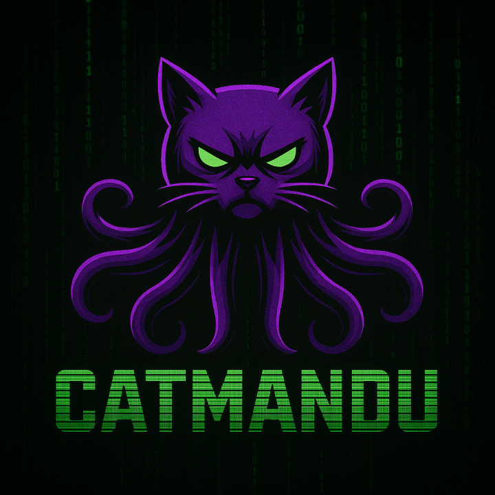
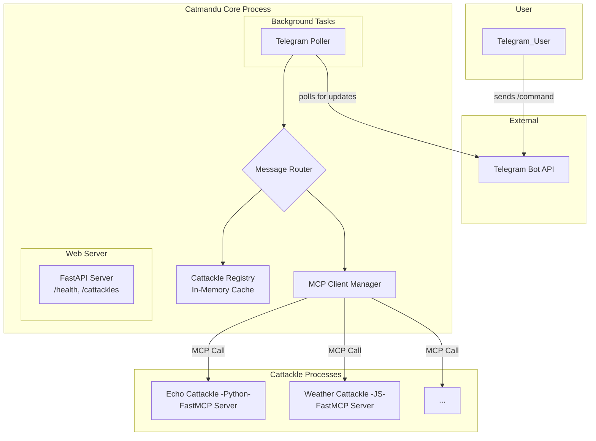

# Catmandu



Catmandu is a modular and extensible Telegram bot built on a core system that handles the primary interactions with the Telegram API, and a pluggable module system for adding new features. These modules, called "cattackles," can be developed in any language and communicate with the core system over a standardized protocol.

## About The Project

The core of Catmandu is a Python application using FastAPI that runs a continuous polling process to fetch updates from Telegram. It uses a dynamic registry to discover and manage available cattackles, and a message router to delegate commands to the appropriate module. This architecture allows for a clean separation of concerns, making it easy to develop and maintain new functionalities without altering the core application.

Key features:

- **Modular Architecture:** Easily add new features through independent "cattackle" modules.
- **Language Agnostic:** Cattackles can be written in any programming language.
- **Dynamic Discovery:** New cattackles are discovered automatically at startup or via an admin endpoint.
- **Centralized Core:** A robust core handles all the boilerplate of Telegram communication.

### Architecture

The system is designed with a central core process that polls for Telegram updates and a set of external cattackle processes that provide the actual bot functionalities.



_Diagram: Flow of a user command through the Catmandu polling system._

## Documentation

### Quick Start

- **[Getting Started](#getting-started)** - Quick setup and installation guide
- **[Docker Deployment](docs/docker.md)** - Complete Docker setup and deployment guide

### Architecture & Design

- **[Architecture Overview](architecture/start.md)** - Implementation plan and system overview
- **[Core Architecture](architecture/ARCH-core-layered-architecture.md)** - Layered architecture design
- **[Cattackle Specification](architecture/spec/ARCH-cattackle-spec-v1.md)** - Module development specification
- **[Recommended Structure](architecture/recommended-structure.md)** - Project organization guidelines

### Components

- **[Core Components](architecture/core/)** - Detailed component specifications
- **[Echo Cattackle](cattackles/echo/README.md)** - Example cattackle with full documentation

### Operations

- **[Chat Logging](docs/chat-logging.md)** - Chat interaction logging system

> **Note**: All documentation is organized in the `docs/` and `architecture/` directories. Each cattackle also includes its own README with specific setup and usage instructions.

## Getting Started

### Prerequisites

- Python 3.13
- [uv](https://github.com/astral-sh/uv) package manager

### Installation

1. Clone the repo
   ```sh
   git clone https://github.com/your_username/catmandu.git
   ```
2. Install Python packages
   ```sh
   uv sync
   ```

## Usage

### Running on Host Machine

1. **Set up environment variables:**

   Create a `.env` file in the root directory and add your configuration:

   ```bash
   cp .env.example .env
   # Edit .env and add your TELEGRAM_BOT_TOKEN and GEMINI_API_KEY
   ```

   Required configuration:

   ```
   TELEGRAM_BOT_TOKEN=your_bot_token_here
   GEMINI_API_KEY=your_gemini_api_key_here
   ```

   Optional configuration for message accumulation:

   ```
   # Maximum number of messages to store per chat (default: 100)
   MAX_MESSAGES_PER_CHAT=100

   # Maximum length of individual messages (default: 1000)
   MAX_MESSAGE_LENGTH=1000
   ```

2. **Run the main application:**

   ```bash
   uvicorn catmandu.main:app --reload
   ```

3. **Run a cattackle:**

   Each cattackle is a separate process. To run the example "echo" cattackle:

   ```bash
   cd cattackles/echo
   # Install its dependencies
   uv pip install -r requirements.txt
   # Run the cattackle server
   python src/server.py
   ```

### Running with Docker

For a complete containerized setup, see the [Docker deployment guide](docs/docker.md).

Quick start:

```bash
cp .env.example .env
# Edit .env with your TELEGRAM_BOT_TOKEN and GEMINI_API_KEY
make docker-up
```

## Cattackles (Modules)

A cattackle is an independent, pluggable module that provides specific features. To be discovered by the core system, a cattackle must have a `cattackle.toml` manifest file in its root directory.

Example `cattackle.toml`:

```toml
[cattackle]
name = "my-cattackle"
version = "1.0.0"
description = "A brief description of the cattackle."

[cattackle.commands]
mycommand = { description = "Description of mycommand" }

[cattackle.mcp]
transport = "stdio" # "stdio", "websocket", or "http"
```

For more details, see the [Cattackle Specification](architecture/spec/ARCH-cattackle-spec-v1.md).

### Available Cattackles

- **[Echo Cattackle](cattackles/echo/README.md)** - Demonstration cattackle with echo, ping, and AI joke features

## API Endpoints

The core application exposes a few administrative endpoints:

- `GET /health`: Returns the operational status of the service.
- `GET /cattackles`: Returns a list of all discovered cattackles and their configurations.
- `POST /admin/reload`: Triggers a re-scan of the cattackles directory to discover new modules.

## Contributing

Contributions are what make the open source community such an amazing place to learn, inspire, and create. Any contributions you make are **greatly appreciated**.

1.  Fork the Project
2.  Create your Feature Branch (`git checkout -b feature/AmazingFeature`)
3.  Commit your Changes (`git commit -m 'Add some AmazingFeature'`)
4.  Push to the Branch (`git push origin feature/AmazingFeature`)
5.  Open a Pull Request

## License

Distributed under the MIT License. See `LICENSE` for more information.
